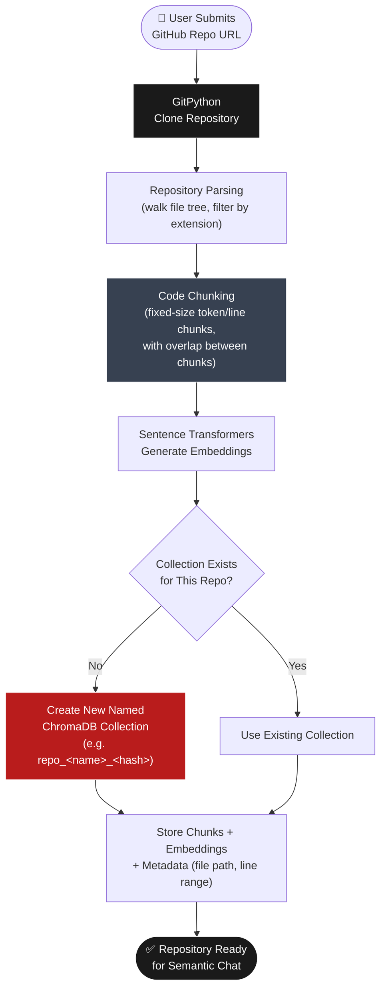
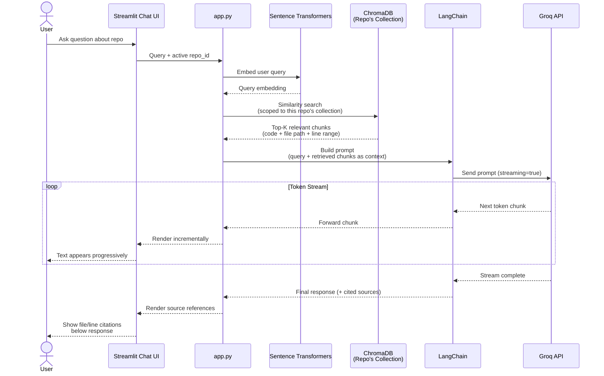
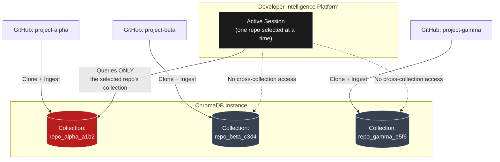

# 🚀 Developer Intelligence Platform

An AI-powered developer assistant capable of semantic repository understanding using Retrieval-Augmented Generation (RAG), vector embeddings, and LLM-powered repository chat.

---

## ✨ Features

- 🔍 Semantic Repository Search
- 💬 AI-Powered Repository Chat
- 🧠 RAG Pipeline
- 📦 GitHub Repository Parsing
- ⚡ Streaming AI Responses
- 🗂️ Multi-Repository Isolation
- 🧩 Intelligent Code Chunking
- 📚 ChromaDB Vector Storage

---
# System Architecture & Diagrams

---

## 🧠 Repository Ingestion Pipeline



---

## 💬 Repository Chat Sequence (RAG Retrieval + Streaming)



---

## 🗂️ Multi-Repository Isolation




## 🛠️ Tech Stack

### Frontend
- Streamlit

### AI / Backend
- Groq API
- Sentence Transformers
- ChromaDB
- LangChain

### Utilities
- GitPython
- Python Dotenv

---

## ⚙️ Installation

### Clone Repository

```bash
git clone <your_repo_url>
cd developer-intelligence-platform
```

### Create Virtual Environment

```bash
python -m venv venv
```

### Activate Virtual Environment

#### Windows

```bash
venv\Scripts\activate
```

### Install Dependencies

```bash
pip install -r requirements.txt
```

### Setup Environment Variables

Create a `.env` file:

```env
GROQ_API_KEY=your_api_key_here
```

### Run Application

```bash
streamlit run app.py
```
---

## 🚀 Future Improvements

- PR Review AI
- Bug Fix Assistant
- Documentation Generator
- GitHub OAuth
- Multi-Agent Workflows

---

## 👨‍💻 Author

Rudra Raj
